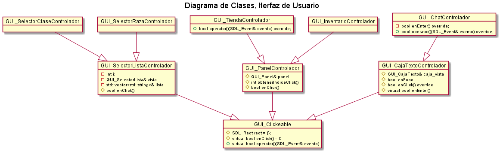
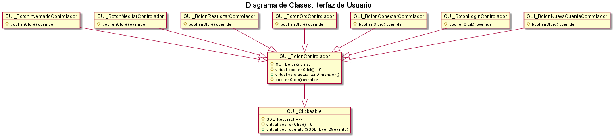

# Trabajo Práctico Final

### Materia: Taller de programación I

### Autores: Ventura Julian, Barreneche Franco, More Agustín


## Introducción

El presente es un informe que acompaña a la resolución del TP Final de la materia Taller de programación I de la Facultad de Ingeniería de la Universidad de Buenos Aires.

Se adjunta el link al repositorio del TP:

https://github.com/JulianVentura/TP-Final-Taller


## Requisitos

- Probado en Ubuntu 64 bits y Linux Mint 32 bits.

- Biblioteca SDL2, SLD_Image, SDL_TTF 
```
sudo apt install -y libsdl2-dev libsdl2-image-dev libsdl2-ttf-dev
```

- Biblioteca Nlohman dev_3.7.0-2: http://mirrors.kernel.org/ubuntu/pool/universe/n/nlohmann-json3/nlohmann-json3-dev_3.7.0-2_all.deb

(Se puede instalar también con `sudo apt install nlohmann-json3-dev`, pero en algunas versiones de ubuntu, se instala la versión 2, que no funciona para el tp).

- Biblioteca de audio incorporada en el propio código, no requiere instalación adicional.

  

## Descripción general

Se parte de un servidor con un hilo aceptador que se encuentra a la espera de nuevas conexiones y múltiples hilos (uno por mapa) que comienzan a gestionar la aparición de criaturas. A medida que se conectan clientes se desencadenan hilos para cada uno, que escuchan los códigos de operaciones que éstos mandan.

Una vez establecida la conexión y resuelto el inicio de sesión, la tarea del servidor se  divide en dos partes: Un módulo activo que actualiza el estado del juego y envía datos de actualización a los clientes. Y múltiples módulos reactivos que procesan las solicitudes de los cliente, modificando el estado del juego.

Por su parte, el cliente se limita a mostrar por pantalla los distintos cambios que ocurren y a proveer una interfaz amigable al usuario para el envío de las operaciones. Dos hilos bastan para ello.

El servidor no conoce el modo en el que el cliente enseña cada componente, mucho menos la interfaz. Sin embargo, para garantizar cierto nivel de sincronización los archivos que describen los mapas se transmiten durante el tiempo de juego.


# Cliente

#### Interfaz de Usuario

Aunque dentro del ámbito académico se practican fuertemente las habilidades vinculadas al desarrollo de modelos óptimos y flexibles, la prioridad principal es siempre lograr que el usuario final se sienta cómodo con el producto, y esto es especialmente cierto cuando se trabaja en un programa destinado al ocio. Siguiendo esta noción, y con el permiso de los correctores, se optó por distanciarse de los comandos por texto en favor de botones y paneles interactuables.

Cuando se realiza un click con el ratón o se presiona alguna tecla, un evento se dispara y llega a una primer capa (`GUI_Principal` / `GUI_Login`), integrada por todos los botones que desencadenan alguna operación (abrir el inventario, comprar o vender, etc). Los botones y paneles se recorren uno a uno hasta que el evento puede ser respondido por uno de ellos. De no ser así, se alcanza la segunda capa, en donde se averigua si existe en el mapa una entidad en la posición marcada y de ser así, se interactúa con ella.

Todas las partes de la interfaz ajustan su posición según el tamaño de la ventana, pero a excepción de las barras y el estante, no se redimensionan. Existe por ende un tamaño de ventana mínimo, debajo del cual colapsan todos los elementos. Considerando que la simultaneidad de clientes se evalúa en la misma computadora se decidió no restringir el área de la ventana, para facilitar la depuración del código y su corrección.

El modelo subyacente aprovecha las virtudes del patrón MVC, las clases fundamentales son:

- `GUI_Principal`: Reúne la vista de los componentes que integran la interfaz de la pantalla de juego principal.  Sus métodos más importantes son actualizarDimension() y render() que llaman de modo ordenado a los mismos métodos de las clases que ésta instancia.

- `GUI_Principal_Controlador`: Su responsabilidad es análoga a `GUI_Principal`, pero con los diversos controladores que agrupa.

- `GUI_Clickeable`: Clase base de todo elemento  de la interfaz con el que puede interactuarse, define un área de interacción en su construcción y verifica si la posición absoluta del ratón está contenida en ella al usar su operador (). De ser así llama a enClick, que es un método puramente virtual.

- `GUI_BotonControlador`, `GUI_PanelControlador` ,`GUI_SelectorListaControlador` y `GUI_CajaTexto_Controlador` heredan de `GUI_Clickeable` e implementan la mayor parte de la lógica que compete a la interfaz en el método enClick. `GUI_BotonControlador` implementa el método actualizarDimension, que se ajusta automáticamente a la posición y dimensión de la vista.

- `GUI_Boton`, `GUI_Panel`, `GUI_SelectorLista` y `GUI_CajaTexto`: Son responsables de mostrar la apariencia que se deduce de sus nombres.

Existen además un gran número de clases que heredan de los controladores y vistas citadas, especificando su comportamiento, su ubicación en la pantalla y su oportuna redimensión ante alguna modificación de la ventana, respectivamente.

- `GUI_Chat_Controlador`: Quizás el componente más interesante de la interfaz, pues es el único que simultáneamente envía y recibe mensajes desde el servidor. Los detalles de la implementación se discuten en la sección de Comunicación con el Servidor.

- `GUI_Chat`: Al igual que su controlador presenta un desafío particular, no poder determinar su aspecto a priori. Renderiza los últimos *n* mensajes en una textura adicional, que se estampa cuadro a cuadro hasta que la llegada de un nuevo mensaje precise actualizar su contenido. A los beneficios en rendimiento de este método se suma la posibilidad de desplazarse verticalmente por la textura (scroll) y así poder mostrar por pantalla una mayor cantidad de mensajes.







#### Mapa y Entidades

Se cuenta con una clase principal `Juego`, que a su vez contiene una `Escena`, `MapaVista` y un mapa de `EntidadeVista`, con su correspondiente modelo `IPosicionable`. El servidor se comunicará con la clase `Juego` para actualizar la información de cada una de sus partes. El mismo responderá cuando aparezca una nueva entidad en el mapa, cambie alguna característica de sus partes o se cambie directamente del mapa cuando el personaje se teletransporta.

La `Escena`, cuenta con dos capas, una será `MapaVista`, que actuará como la capa de fondo, y el otro será `CapaFrontal`. está última se dibujará según un orden inducido para poder dar el efecto de solapamiento. Ordenar las capas es costoso, o lo sería si se lo hace sobre todo el mapa. Aquí  es donde resulta útil que `Escena` tenga una referencia a la `Camara` para poder acotar lo que dibujará a solamente lo visible, esto, una cantidad relativamente pequeña y constante, sin importar que el usuario redimensione la pantalla o si el mapa es inmenso.

Para crear cada una de las partes del `Juego` se cuentan con clases específicas de parseo de archivos, (principalmente de `imagenes.json`), lo que permite, hacer modificaciones de forma dinámica sin tener que recompilar el proyecto.

Para el apartado de animaciones, se cuentan con las clases `Sprite`, `Animacion`y sus derivados que serán detallados en el siguiente apartado.

Se cuenta, además, con un controlador que se encargará de manejar las solicitudes de movimiento que requiera el usuario, este es `MovibleControlador`.

La estructura básica del proyecto de una forma primitiva consiste en las clases genéricas:

- `EntornoGrafico`: Almacenará la información de ventana y renderer, que se utilizarán en el resto del programa. El mismo, se encarga de iniciar `SDL` y sus componentes secuencialmente, como así también destruirlos correctamente. También cumple la función de almacén de recursos, permitiendo así, tener una suerte de proxy entre los recursos del sistema (imágenes, fuentes) y el resto de clases, este intermediario, se asegurará de no cargar dos veces el mismo recurso (salvo que se lo fuerce por alguna razón). Internamente, conoce tanto a la `Ventana` y al `Renderer`, información útil para todo objeto `IRenderable`, por tal motivo, es común ver que los `IRendereables` reciba por parámetro en el constructor, una referencia a este entorno.

- `Ventana`: Inmediatamente cuando se crea el entorno, también se crea el objeto ventana, la misma encapsula las funciones de `SDL_Window`. Esta clase contará con una un vector de `IRendereables`. Cuando se llama a `Ventana::render` también se llamará al render de los correspondientes elementos dentro de la ventana, previamente actualizados.

- `Renderer`: Será el encargado de manejar las funciones de dibujo. Además, cuenta con funciones de transformaciones (traslado y escalado). Cuenta con las operaciones de dibujar rectas, rectángulos, texturas, texto. Los mismos pueden modificar tamaño, colores y posiciones.

- `BuclePrincipal`: Juega el papel de `GameLoop`, que estará escuchando a eventos y cuando recibe alguno, lo despachará a los `IInteractivos` que tiene almacenado. La propagación del evento será lineal, además de de que cortará la propagación cuando el primer interactivo haya consumido el evento. Cada interactivo puede subscribirse a más de un evento. Una vez despachado el evento, se procede a actualizar la ventana (y por consiguiente a los rendereables que contiene) y llama a `Ventana::render`. Una vez finalizado, se cuenta el tiempo que tardo todo el proceso, y se duermo un tiempo hasta completar un tiempo constante, permitiendo así, tener un framerate más estable.


<p align="center"> 
   
</p>


Una vez terminada la sesión del login, el cliente se queda a la espera de que el servidor envíe el primer mapa. Esta espera se implementa con una `contion_variable`. Una vez recibido el mapa comieza la construcción de `Juego`.

- `Juego`: Contendrá toda la información necesaria apara mostrar el mapa, mostrar los personajes y que puedan interactuar. Al recibir el mapa, comienza el parseo. La estructura del mapa consiste en un archivo `.json` que cuenta con una serie de capas (vectores unidimensionables mapeables a una matriz) y también con un conjunto de tiles que cuentan con la información de imágenes que presenta el mapa. Este archivo es generado por Tiled. Para parsear este archivo, un tanto complicado, se separa el parseo en distintas clases:
  - `LibreriaConjuntoTileParser`: Lee e interpreta la información de imagenes que tiene el mapa, además de cargar las imágenes. Cada conjunto de tile tiene columnas, primer id global (es un id incremental compartido por todos los conjuntos de tiles), una imágen, la cantidad de tiles que tiene, el ancho y alto del mismo.
  - `CapaFrontalParser`: Para permitir el solapamiento entre sprites del juego, en el mapa, por cada entidad obstruible (es decir que alguien se puede poner detrás de esta entidad y este debería ser tapado por la entidad), se agrega un rectángulo sobre el área del sprite. Este paserser será el encargado de leer esta información y convertirla en información útil para el rendereo.
  - `MapaParser`: El mapa en sí, consiste, en una serie de capas que tiene un vector conteniendo un id global (`guid`) que identifica a un tile en específico el parser se encargará de leer esta información.

Con la información rescatada por los parsers, se procede a crear `LibreriaConjuntoTiles`, `CapaFrontal` y `MapaVista`. 

Se tiene la clase `TileConjunto` que es creado con la información que brinda `LibreriaConjuntoTileParser`, esto simplifica el acceso por `guids` a la imagen en concreto.

La capa frontal, cuenta con una serie de objetos `IObstruible` que fueron parseados previamente, tienen la particularidad de que de una imagen, solo se van a mostrar ciertos cuadros. Dentro de capa frontal, se filtran los obstaculos que están en el campo de visión, y se les aplica un `std::stable_sort` con una funcion de comparación (en pseudo-código): 
``` python
def comparar(unObstruible, otroObstruible):
    return unObstruible.y + unObstruible.alto < otro.y + otro.alto
```

Esto permite que los obstruibles que se encuentren más abajo del mapa se muestren al frente. Gracias a la acotación, se reduce el tamaño de obstruibles (en un mapa mediano) de ~300 a ~20.

Adicionalmente se crean la `Camara` (que se encargará de centrar y redimensionar la imagen al centro del personaje y además brindar esta información para acotar el rango de rendereado), la `Escena` que orquestará la disposición de la cámara (y su reinicio) y el rendereado de la capa y del mapa. Además se crea el controlador `MovibleControlador` que escuchará los eventos de teclado y cuando detecte alguna tecla ligada al movimiento, enviará la solicitud al servidor. 

A medida que el servidor va a notificando las posiciones de las entidades (personaje, enemigo, npc, objetos), en `Juego`, se verificará si esa entidad es una entidad es conocida, en tal caso, le actualizará la posición. Caso contrario, se creará tanto el modelo `IPosicionable` y la vista `EntidadVista`. El modelo encapsula la posición de la entidad y si esa posición está actualizada (información útil al animar en direcciones); la vista, contendrá toda la información relacionada con el dibujo de la entidad, incluyendo la/s imágen/es que correspondan con la entidad como la animación del mismo. La información acerca de la vista, será levantada y parseada del archivo `imagenes.json`, en el mismo se tiene cómo se compone cada entidad, qué imágenes cuenta y qué animacion le corresponde.

Se cuentan con tres tipos de animaciones: 
- `AnimacionEstática`: La misma corresponde a una entidad que no se moverá o que el moviento no afecta en nada a la animación. 
- `AnimacionCuatroDirecciones`: La entidad cuenta con cuatro estados: arriba, derecha, abajo e izquierda. La dirección se determinará con la información que brinda el modelo. En base a eso, se calcula un delta x y un delta y, mapeándolo a una dirección en particular. Para evitar, que los cambios pequeños en la dirección generen una animación errática, se disminuye la tolerancia de los rangos del ángulo, quedando así regiones vacías cerca de las uniones, en caso de que el ángulo se encuentre en ese rango, no se actualiza la dirección y se usa la dirección anterior. Por ejemplo, en vez de tomar como derecha [-pi/2, pi/2], se toma un rango más pequeño que se ilustra en la siguiente imagen.

<p align="center"> 
   
</p>

- `AnimacionOchoDirecciones`: idem anterior salvo por que los intervalos se encuentra solapados porque aumentan las combinaciones de direcciones a 8.

Si bien, solamente se diseñaron e implementaron estas tres animaciones, se pueden agregar más tipos de animaciones, sin modificar código preexistente, respetando el principio open-closed.

Cada entidad, además de tener una animación asociada, tiene `DatosApariencia`, que recibe del servidor de manera análoga a las posiciones, que modifica cómo se mostrará el personaje. Toda la configuración se encuentra en el archivo `imagenes.json`. 

Por cuestiones de optimización, los sprites y la información son compartidas por todas las entidades, con lo cual el modificar un sprite tiene que hacerse inmediatamente antes de mostrar el sprite en la pantalla. Este comportamiento se encapsula en la clase `Sprite` que en base a la apariencia (clase, raza, tipo, estado) se determina qué animación e imagen corresponde.

Estructura archivo
---
#### Archivo `imagenes.json`

Cada entidad, en tiene asociada una estructura:
``` json
"estructura": {
    "cuerpo": ["path_to_img"],
    "ojos": ["path_to_img"],
    "cicatrices": [],
    "nariz": ["path_to_img"],
    "orejas": [],
    "facial": [],
    "pies": [],
    "piernas": [],
    "torso": [],
    "cinto": [],
    "pelo": [],
    "cabeza": []
}
```

Donde uno puede definir qué imagen se va a mostrar para cada parte. Además se le puede sobreescribir el atributo `"animacion"`, para brindarle una animación personalizada, por ejemplo:
``` json
"Arania": {
    "ancho": 40,
    "alto": 40,
    "imagen" : ["spider1.png"],
    "animacion": "arania"
}
```
Donde luego, en el apartado de animaciones, tendrá que aparecer alguno con el id `arania`.

``` json
"arania": {
    "Ancho": 48,
    "Alto": 48,
    "tiempo_por_cuadro": 60,
    "tiempo_entre_ciclo": 0,
    "Direcciones": 4,
    "Columnas": 3,
    "Columna": 0,
    "Estado-Inicial": "Mover",
    "Direccion-Inicial": "Abajo",
    "Estados": {
        "Mover-Abajo": {
            "fila": 0,
            "cantidad": 3
        },
        "Mover-Izquierda": {
            "fila": 1,
            "cantidad": 3
        },
        "Mover-Derecha": {
            "fila": 2,
            "cantidad": 3
        },
        "Mover-Arriba": {
            "fila": 3,
            "cantidad": 3
        }
    }
},
```
Donde `ancho` y `alto`, serán la dimensión del cuadro de la animación, `tiempo_por_cuadro` tiempo entre cuadro y cuadro, `tiempo_entre_ciclo`
el tiempo entre que termina la animación y se reproduce nuevamente; `Direcciones` cantidad de direcciones (si hay 0 será una animación estática, si hay 4 será de 4 direcciones y si vale 8 será animación de 8 direcciones); `Columna` será la columna desde que se empieza a contar el sprite; `Columnas` cantidad _total_ de columnas que tiene el sprite (sería la máxima cantidad de filas ocupadas por fila); luego en cada estado, se definen la cantidad de columnas partículares que tiene esa animación en específico.

#### Creacion de mapas

Para la creación de mapas, se utiliza la herramiente _Tiled_. El mismo brinda una interfaz intuitiva para generar mapas de tipo tile y exportarlo al formato `json`.

Para comenzas, se descarga e instala (si corresponde) [_Tiled_](https://www.mapeditor.org/).

Se va a `File>New>New Map`, se deja la configuración por defecto, se puede cambiar el tamaño. 

<p align="center"> 
   
</p>

Una vez agregado se pueden agregar imágenes, es importante que esté activado el tick `Embed in map` (esto hace que la información de la imagen, quede en el mismo archivo del mapa y no en un archivo adicional). En caso de que la imagen cuente con un fondo que quiesieramos quitar, se puede usar `Use transparent color` y hay que seleccionar el color de fondo.

<p align="center"> 
   
</p>

Una vez cargado, debería aparecer en la ventana de tiles y para agregarlo al mapa bastaría con pintar en el mapa.


<p align="center"> 
   
</p>


Para que funcione correctamente el mapa en nuestro juego, se debe respetar la siguiente estructura de capas

<p align="center"> 
   
</p>

- Una capa de objetos con nombre `colisionables` (acá estarán los rectangulos donde se chequearan colisiones). Todos los rectangulos tienen que estar dentro del mapa. (Cuidado con los bordes).
- Una capa `spawnPasivos` que contendrá rectangulos donde cada rectangulo tendrá por nombre el tipo de entidad que contendrá.
- La capa `respawn` definirá las zonas donde aparecerán las crituras.
- En el grupo `frente`
   - Por cada capa de de tiles, habrá una capa de objetos con el mismo nombre encima. La capa de tiles contendrá las imágenes.
   - Si se quiere hacer que un objeto sea obstruible (una lámpara por ejemplo), en la capa de objetos, se debe agregar un rectangulo que abarque toda la imagen de la lámpara. (Recomendación, cuidar el límite).
- En el grupo `fondo`
  - Solo habrá capas de tiles, no hay restricciones.


#### Comunicación con el Servidor

La comunicación cliente-servidor suele plantearse como dos interlocutores conversando, pero seguir esta interpretación tan natural, puede llevar a la proliferación de referencias y dependencias cruzadas, muy dificiles de refactorizar en el futuro.

Para el componente del chat no hubo otra alternativa, la entrada y salida de mensajes se canalizan mediante una única instancia de la clase `ServidorProxy`. A los componentes que solo necesitan al servidor para enviar distintas señales (como la de meditación) se les transmite la referencia al ServidorProxy. La solución inmediata es hacer lo inverso con las que solo necesiten recibir información desde el servidor, no obstante esto eventualmente conduce a una clase ServidorProxy que conoce demasiado e incorpora lógica que no le corresponde. La alternativa adoptada se inspira en las planillas que acompañan a los pacientes de los hospitales, y pueden ser leídas/modificadas anacrónicamente por el personal. ServidorProxy conoce dos estructuras de datos: `DatosPersonaje` y `DatosTienda` y se encarga de mantenerlas actualizadas. Al resto de los componentes solo se les transmite la referencia a los campos que necesitan para funcionar. Los atributos son atómicos y cuando se requiere correlacionar dos de ellos (como vida y vida máxima) lo peor que puede ocurrir a raíz de una condición de carrera es que se muestre información incorrecta durante unos instantes.


Las clases más importantes que componen este módulo son:

- `Protocolo`: Permite independizarse de las nociones de endianness, sockets y , precisamente, el protocolo. Inicialmente enviaba directamente por socket algún tipo de dato preestablecido, no obstante conforme evolucionó el proyecto surgió la necesidad de incorporar medidas contra el desborde del buffer interno de la operación `send` de los sockets. Por lo que recibe datos directamente del socket, pero para enviar compone primero una tira de bytes, que devuelve en su métodofinalizarEnvio().

- `Mensaje`: Encapsula la tira de bytes que compone un mensaje. Permite conocer su tamaño o agregar más bytes al final.

- `ColaBloqueanteMensajes`: Especialización de una cola bloqueante que permite conocer la cantidad total de bytes almacenados.

- `ProxyEnviador`: Encapsula un hilo que desencola mensajes y los envía. De este modo se aliviana el funcionamiento del ciclo (gameloop) en situaciones extremas, como una conexión lenta.

- `ServidorProxy`:  Su responsabilidad fue especificada en la descripción general. Adicionalmente vale la pena notar que la salida del ServidorProxy es redireccionable. En un primer momento se conecta con `ServidorAlerta` para comunicar al usuario cualquier problema en el inicio de sesión, mientras que durante el tiempo de juego se conecta al Chat.

##### Protocolo

El protocolo requiere del envío de enteros de 8, 16 y 32 bits y cadenas de texto. Todo entero se transmite en formato Big Endian y a las cadenas de texto las encabezan un entero de 32 bits que marca su longitud. 

A cada operación le precede un identificador único de 32 bits que permite conocer cómo se deben interpretar los bytes recibidos. Si el código de operación no es conocido no puede determinarse cuales de los bytes subsiguientes se corresponderán con la operación fallida y cuáles con la siguiente operación, por lo que no queda más remedio que interrumpir la comunicación entre servidor y cliente.


#### Música y sonidos

Se emplea la clase singleton `EntornoMusical` para reproducir cualquier tipo de audio. Internamente se utiliza una biblioteca externa para superar las limitaciones de SDL2. Todas las pistas se levantan del disco al momento de la construcción para evitar discontinuidades en el tiempo de respuesta y se organizan en un hash para su fácil acceso.

El mayor desafío de esta área fue determinar cuándo se debía reproducir un sonido determinado, pues en general no se sabe las causas directas de los cambios que el servidor envía. Para los ataques, se reproduce el efecto adecuado la primera vez que aparece un proyectil. La música de fondo no requiere complejas formulaciones, pues cambia solo cuando se inicia sesión exitosamente. Proyectos más abarcativos podrían requerir de la implementación de mensajes cliente-servidor adicionales, que marquen el momento de emitir algún sonido.


## Servidor

### Modelo

#### Salas, Bucles y Mapas

Las entidades del juego fueron modeladas teniendo en cuenta un nivel de abstracción que permitiese un manejo completamente genérico de las mismas , teniendo como resultado un mapa de juego versátil, expandible y sencillo de comprender.

Desde un principio se tuvo la idea de modelar el mundo de Argentum a través de distintos mapas unidos por portales, con el objetivo de distribuir la carga del servidor y cliente en pequeñas porciones de terreno.

Estos mapas debían ser independientes y tener conocimiento únicamente de las entidades que manejaban. Para lograr esto se empleo la idea de `Sala`.

Una `Sala` es una clase que administra un `Mapa` e interactua con los distintos clientes que se han conectado a la misma, mas de esto luego. Una `Sala` necesita ser independiente de las demas, por lo tanto es necesario que disponga de un `BuclePrincipal` que marque el correr del tiempo en el mapa que le pertenece.

Las principales clases utilizadas para el modelado de una `Sala` fueron las siguientes.

- `Sala`: Administra a los clientes que desean conectarse a un mapa en particular, encargandose de actualizar sus estados, cargarlos y eliminarlos segun corresponda. Cada sala tiene un `BuclePrincipal` que le marca el tiempo de juego a todas las entidades de la misma. Ademas cada sala tiene un `Mapa` sobre el cual delega los comportamientos de las entidades entre si.

Los metodos mas importantes son:

* cargarCliente(): Carga un nuevo cliente a la sala y su personaje al mapa.
* actualizarClientes(): Envia informacion del estado de las entidades del mapa a los clientes conectados a la misma.
* eliminarCliente(): Elimina el cliente de la sala, antes eliminando al personaje correspondiente del mapa.
* persistirClientes(): Indica la señal de persistencia periodica al persistidor

- `BuclePrincipal`: Administra el paso del tiempo en cada `Sala` enviando las ordenes de actualizacion de estados a las entidades y clientes. Para esto delega en un `Reloj` que le permite marcar con precision el tiempo transcurrido y en instancias de `Operacion` que le permite ejecutar las operaciones de los distintos clientes, entre otras.

Los metodos mas importantes son:

* procesar(): Corre el ciclo del gameloop, ordenando a la sala y el mapa que realicen distintas acciones en base al tiempo transcurrido.
* procesarOperaciones(): Desencola y ejecuta las operaciones de la cola de operaciones.

- `Mapa`: Administra los movimientos de las entidades que habitan en el, siendo la unica autoridad que puede cambiar la posicion de alguna de ellas. Ademas permite realizar un acceso rapido a cualquier entidad que lo habita por medio de su id, lo que es muy util al resolver las operaciones de los clientes.
El modelado del mapa fue resuelto utilizando un `Quadtree` extraido de internet (ver fuentes) que permite disminuir la cantidad de chequeos a realizar para determinar la colision entre dos entidades o entre una entidad y un objeto fisico, como puede ser una pared.
El mapa ademas es capaz de realizar un spawn de distintas instancias de `Criatura` en zonas aleatorias segun sea configurado, para esto delega en `FabricaDeNPC`.
Por ultimo, el mapa recibe la orden de actualizar los estados de las entidades, que desencadenara, entre otras cosas, el spawn de nuevas entidades y movimiento o despawn de otras. Esta orden es proveniente del `BuclePrincipal`.

Los metodos mas importantes son:

* actualizarPosicion(): Actualiza la posicion de una entidad en el mapa, si es que la nueva posicion es valida. 

* recolectarPosiciones(): Devuelve informacion de las posiciones de cada entidad del mapa

* obtener(): Devuelve un puntero a entidad en base a un id.

* obtenerEntidades(): Devuelve todas las entidades que abarcan un area del mapa.

* entidadesActualizarEstados(): Actualiza el estado de todas las entidades del mapa, ejecuta la carga de entidades y carga criaturas al mapa, si es posible.

* eliminarEntidad(): Elimina una entidad del mapa

* eliminarEntidadNoColisionable(): Elimina una entidad no colisionable del mapa (util para proyectiles)

* cargarEntidad(): Carga una entidad al mapa

* cargarEntidadNoColisionable(): Carga una entidad al mapa, la cual no sera colisionable (util para proyectiles)

  


#### Entidades

Como se menciono anteriormente, en el modelo se busco lograr una abstraccion que permita manejar a los personajes, criaturas y ciudadanos en conjunto, facilitando asi el trabajo del mapa y aumentando la extensibilidad del modelo.
Para esto fue necesario declarar las siguientes clases abstractas y no abstractas:
- `Colisionable`: Tiene una posicion y ocupa un area, puede colisionar con otro colisionable.
La posicion sera modelada por la clase `Posicion`.
- `Movible`: Un movible es `Colisionable`, pero ademas permite que la posicion sea cambiada. El comportamiento de movimiento tambien es delegado en la clase `Posicion`.
- `Interactuable`: Clase abstracta, modela todo tipo de interaccion entre las entidades. Algunas de ellas pueden ser atacar, vender, comprar, interactuar. Un interactuable es `Movible`. Como distincion importante, toda instancia de `Interactuable` tiene un id que la diferencia de las demas.
- `Entidad`: Clase abstracta, agrega la capacidad de actualizar un estado, la capacidad de estar presente en un mapa y algunos atributos inherentes a una entidad, como puede ser la vida o mana.

De esta forma ahora podemos aclarar que todo lo que es posicionable en un mapa, a excepcion de los objetos fisicos, es una `Entidad`.

Las clases derivadas de `Entidad` que fueron implementadas son las siguientes:

- `Personaje`: Modela al personaje del cual es dueño el jugador, el mismo es capaz de atacar, interactuar, moverse, subir de nivel, equiparse y cambiar de mapas, entre otras cosas. Sin duda alguna es de las clases mas importantes del juego. Delega mucho de su comportamiento en las clases derivadas de `Estado`, `Arma` e `Inventario`. Los distintos estados del personaje permiten modelar situaciones como penalizacion de movimiento, muerte o meditacion siendo muy importantes al momento de interactuar con otras entidades y en la actualizacion de estado del mismo personaje.
- `Criatura`: Modela a los enemigos principales del juego, los NPC agresivos que pueden ser encontrados a lo largo de los mapas. Toda criatura buscara perseguir y atacar al jugador hasta matarlo, siempre y cuando el mismo se encuentre en su rango de visibilidad. Las criaturas son mas sencillas que los personajes, delegan su comportamiento unicamente en `Arma`.
- `Ciudadanos`: No existe una clase `Ciudadano` en el modelo ya que no se la vio necesaria, sin embargo se la menciona aqui para poder englobar, de forma muy generica, el accionar de las clases `Sacerdote`, `Comerciante` y `Banquero`. Los ciudadanos son NPC pacificos, es decir que no pueden ser atacados y solo se los encontraran en las ciudades. A pesar de ser entidades los ciudadanos no utilizaran sus atributos de vida, mana y experiencia ya que nunca entraran en combate, ni tampoco se moveran de sus posiciones de spawn configuradas.
- `BolsaDeItems`: Modela una bolsa que es spawneada cuando un `Personaje` o `Criatura` muere en el mapa, su accionar es muy similar al de los ciudadanos. Se entrara en detalle sobre esta clase en la seccion de drops.
- `Proyectil`: Modela, como su nombre lo indica, un proyectil que es lanzado cuando un `Arma` efectua un ataque. Su principal caracteristica es seguir en linea recta la trayectoria marcada por la entidad atacante y la entidad objetivo, permitiendo de esta forma obtener un efecto de proyectil visto desde el cliente. Es la entidad mas sencilla de todas, ya que no puede ser interaccionada ni atacada e incluso es cargada en `Mapa` como una entidad no colisionable con el objetivo de mejorar la eficiencia del servidor y evitar impactos no deseados.
- `Portal`: Modela, como su nombre lo indica, a un portal sobre el cual el personaje podra interactuar, teniendo como resultado la teletransportacion del mismo a un mapa o ciudad que dependera del portal con el que se interactue. Un portal no puede ser atacado ni hara uso de sus atributos de entidad, mas alla de su posicion.

Como puede apreciarse, la principal contra de buscar un modelo que interprete a las entidades del mapa de forma abstracta sera que muchas de ellas deberan implementar metodos que realmente no tendran utilidad alguna en el juego, sin embargo se considera que el balance es completamente positivo.

Los principales metodos de todas estas entidades seran:

* interactuar()
* comprar()
* vender()
* listar()
* transaccion()
* atacar()
* serAtacadoPor()
* recibirDanio()
* recibirCuracion()
  

Todos ellos deberan ser implementados por las clases derivadas de entidad, sin embargo esto no significa que los mismos tengan siempre alguna responsabilidad.
Los metodos de combate son necesarios para los personajes y criaturas pero inutiles para un ciudadano o un portal.

Puntualizando en el personaje se pueden agregar unos metodos mas:

* actualizarEstado(): Permite al jugador moverse y regenerar vida.
* equipar(): Permite equipar una pieza de equipo proporcionada como parametro.
* desequipar(): Permite desequipar una pieza de equipo proporcionada como parametro.
* obtenerExperiencia(): Permite obtener cierta cantidad de experiencia, implicando una posible subida de nivel
* dropearItems(): Elimina todos los items del inventario y spawnea una BolsaDeItems en el mapa, junto al personaje. La bolsa contendra los items dropeados.
* estadoNormal(): Cambia el estado a normal
* estadoFantasma(): Cambia el estado a fantasma
* estadoInmovilizado(): Cambia el estado a inmovilizado
* estadoMeditacion(): Cambia el estado a meditacion

Puntualizando en el caso de criatura se puede agregar otro metodo:

* actualizarEstado(): Ejecuta la IA de la criatura, donde buscara a un objetivo para atacar.

  

  

  


#### Combate y drops.

Como se introdujo en la sección anterior, toda derivada de `Interactuable` y por lo tanto toda `Entidad` es atacable. Sin embargo algunas de ellas implementan los métodos de ataque de forma tal de no afectar el estado del juego, como por ejemplo el caso de los ciudadanos.
A continuación se detallara la lógica de ataque en las clases `Personaje` y `Criatura`.

Todo ataque proveniente de un personaje es debido a la decodificación de una `OperacionAtaque` creada en el `ClienteProxy` y ejecutada en el `BuclePrincipal` del mapa en el cual se encuentra conectado el usuario, más de esto se detallara en la sección de conexión.

Como se menciono anteriormente, toda derivada de `Interactuable` tiene un id que la permite diferenciar de otras instancias. El mapa permite obtener una instancia de `Entidad` dado su id, el cual es obtenido por el servidor a partir del cliente.

En la operación de ataque se ira a buscar al `Mapa` la entidad correspondiente al id obtenido, para luego ser atacada por el personaje. Para poder implementar distintos tipos de comportamientos en base a la entidad que esta siendo atacada fue necesario implementar un double-dispatch en la lógica de ataque. Entonces, cuando una entidad es atacada se llama a su método `serAtacada()` dando inicio a la cadena de llamados.

En el caso de un ataque a una instancia no atacable, como puede ser un ciudadano, el ataque no se realiza. Caso contrario el ataque será delegado en el estado del atacante

``` C++

Entidad::serAtacada(Personaje *personaje){
    personaje->atacar(this);
}

Personaje::atacar(Criatura *criatura){
    estado->atacar(criatura);
}

```

Como se explico anteriormente, fue necesario implementar un estado por personaje que permitiese modelar distintas situaciones. Puntualmente en este caso, un fantasma no puede realizar un ataque, por lo tanto la cadena de llamados seria finalizada al llegar al `EstadoFantasma`

``` C++

EstadoFantasma::atacar(Criatura *criatura){
    //Metodo vacio
}

```

Si el ataque puede ser efectuado entonces se delegara a su vez en el `Arma` que el jugador tiene equipada. La misma podrá realizar el ataque según estén dadas las condiciones. Suponiendo que el ataque es realizado se llegara al ultimo paso de la cadena, que es el método `recibirDanio()`
En este metodo, obligatorio para todo `Interactuable`, pueden suceder dos cosas tales como que el objetivo evada el golpe o que el atacante realice un golpe critico.
En este metodo se reducira la vida del objetivo segun el daño recibido, se le proporcionara experiencia al atacante y, si la vida del objetivo llega a cero, el mismo dropeara.

Si el objetivo es un personaje, todo su inventario será vaciado y cada item será movido a una instancia de `BolsaDeItems` que será spawneada al lado del mismo. Dicha bolsa podrá ser accedida por cualquier personaje, obteniendo así los items del caído.
El personaje muerto además le entregara su oro al atacante y pasara a `EstadoFantasma`. En este estado el personaje no podrá realizar ningún ataque o interacción pero si podrá moverse. Su única salvación será ser resucitado por un sacerdote ya sea viajando hacia el o utilizando el comando de resucitar.

Si el objetivo es una criatura, existirá cierta probabilidad de dropear oro o algún item del juego. Esta probabilidad, y los items que pueden ser dropeados, será configurada en el archivo de configuraciones. Al igual que con el personaje, si un item es dropeado se creara una instancia de `BolsaDeItems` al lado del cadaver de la criatura, tras lo cual la misma será despawneada del mapa.

En el caso de un ataque proveniente de una criatura la lógica es la misma, pero el comienzo de la cadena es distinto.
Las criaturas, como se menciono anteriormente, estarán constantemente buscando algún objetivo para cazar, esto lo hacen pidiéndole a `Mapa` que le devuelva una lista con las entidades que entran en su área de visibilidad. Si un personaje entra en la misma, la criatura comenzara a perseguirlo e intentar matarlo.
Si el personaje es lo suficientemente rápido podrá superar el radio de agresividad de la criatura y la misma dejara de buscarlo. Vale aclarar que el radio de agresividad es siempre mayor al de visibilidad.
Es importante destacar que la criatura no puede fijar siempre al mismo objetivo, ya que el personaje puede desconectarse repentinamente o morir, por lo tanto será necesario que constantemente se realicen chequeos que avalen al jugador como objetivo.

Tras cada ataque que un jugador efectúe hacia otro jugador o una criatura el mismo recibirá experiencia en base a una formula localizada en `Configuraciones`.

Cuando el jugador supera el limite de experiencia pasara a un nuevo nivel.
Para darle mas diversión al juego se incluyo al modelo un sistema de escalado de atributos en base al nivel del personaje, su raza y su clase, los mismos son configurables en el archivo de configuraciones y en `Configuraciones`

En el enunciado se pedía que en el juego existiesen zonas seguras y lógica de FairPlay.
Para la primera, aprovechando que el modelo permite la creacion de multiples mapas, se decidio hacer una ciudad en la cual no spawnean criaturas y todo tipo de ataque esta prohibido, esto se chequea antes de realizar un ataque.
Para la logica de FairPlay el chequeo se realiza al momento de atacar o ser atacado por un personaje, el nivel de newbie y la diferencia de niveles son configurables en el archivo de configuraciones.


#### Razas y clases

Mientras se diseñaba el modelo del juego se observo que ni las clases ni las razas tenían un comportamiento marcado que merezca la creación de una clase para cada una de ellas, de hecho el comportamiento es tan básico como el de un contenedor de atributos, por lo tanto se busco realizar dos clases genéricas `Clase`, que modela las clases y `Raza` que modela las razas.
Cada uno de los atributos especiales de ellas sera configurado desde el archivo de configuraciones e inicializado segun sea necesario. De esta forma, al momento de especificar, por ejemplo, una clase guerrero sera tan sencillo como crear una instancia de `Clase` utilizando el id `"Guerrero"`, definido en el archivo de configuraciones. Analogamente para las razas.

El peso de las mismas será notorio únicamente en las formulas del juego, todas ellas contenidas en la clase `Configuraciones`. 

Algo que vale la pena mencionar es que en el enunciado se aclara que un guerrero no podrá meditar ni utilizar mana. La solución a esto fue muy sencilla, ya que desde el mismo archivo de configuraciones se puede elegir que el atributo `FClaseMana` sea igual a cero implicando que el guerrero tendrá mana máximo cero para siempre y de esta forma no podrá ni meditar ni utilizar magia.

#### Items

Para modelar el equipo del juego se creo una clase abstracta `Item`, la cual responde a los mensajes de `equipar()`, `desequipar()` y `utilizar()`, entre otros. Esto permitió tratar a todos los items del juego genéricamente y facilitar notablemente el almacenamiento de los mismos en el inventario del jugador o en el banquero, tienda y bolsa de items.


En cuanto al comportamiento de los items, sucede algo muy similar a lo que se menciono en las clases y razas ya que se pueden abstraer dichos comportamientos en clases genéricas que permitan ajustar sus atributos internos con el propósito de modelar distintos items. Siguiendo esta idea, estas son las clases creadas en el modelo para modelar a todos los items del juego

- Arma
- ArmaCuracion
- Armadura
- Escudo
- Casco
- Pocion
- ItemNulo

De esta forma, al momento de crear una espada se puede hacer lo siguiente

```C++

Arma arma("Espada");

```

Donde la id `"Espada"` esta definida en el archivo de configuraciones.

El caso de la clase `ArmaCuracion` fue una excepción al comportamiento genérico de las armas, ya que la misma en lugar de realizar daño sobre el objetivo, lo curara. En un principio se pensó la idea de modelar este comportamiento con un a instancia de `Arma` genérica que tenga un daño negativo, sin embargo el efecto resultante era confuso para el usuario.
Cabe aclarar que la clase `ArmaCuracion` hereda de `Arma` y sobrescribe el metodo de `atacar()`, por lo tanto la secuencia de uso de ambas es la misma.

El caso de las armaduras, cascos y escudos es aun mas absurdo, su única utilidad es la de almacenar dos atributos cada uno ya que no tienen ningún papel en combate, mas alla de ser utilizados por `Configuraciones` para el calculo de la defensa.
Por mas que el comportamiento entre ellas sea identico fue necesario realizar una clase para cada una para lograr evitar que un personaje pueda equiparse una pieza en un lugar donde no corresponda.

El caso de las pociones es muy similar, se logro combinar a las pociones de mana y de vida bajo una unica clase que cura al objetivo según haya sido configurada.

Al lector podrá parecerle extraña la clase `ItemNulo`, el motivo de  su uso en vez de **nullptr** para representar posiciones vacías del inventario, almacén,bolsa o tienda es el de evitar condicionales y poder tratar a todos los potenciales elementos de los contenedores uniformemente cuando se los serializa.


Finalmente, para abstraer la creacion de los items e incorporar una creacion de items aleatoria (para los drops de criaturas) se creo la clase `FabricaDeItems`, que como su nombre lo indica permite abstraer la creacion de un item.

Los principales metodos de la `FabricaDeItems` son los siguientes:


* obtenerItemAleatorio(): Permite obtener un item aleatorio a partir del id de una criatura.
* obtenerItemIDTCP(): Permite obtener un item dado su idTCP, para lo cual sera necesario realizar cierto parseo.
* crearItemNulo();
* crearArma();
* crearArmadura();
* crearEscudo();
* crearCasco();
* crearPocion();

Siguiendo la lógica del enunciado, dado que todas las piezas del equipo son iguales, no tienen  comportamiento y tampoco desgaste surgió la idea de que la `FabricaDeItems` crease a los distintos items una única vez y compartiese los punteros a dichos items a cada una de las entidades que los necesiten.
Es decir que si dos entidades tienen una espada, en realidad ambas tienen una copia del puntero que apunta a la misma espada la cual esta localizada en `FabricaDeItems` y asignada en memoria dinamica.
Esta idea permitió una simplificación muy importante en el trabajo, ya que la perdida de memoria se hizo prácticamente nula.

Para facilitar el acceso a los items desde cualquier punto del juego fue necesario hacer que `FabricaDeItems` fuese un singleton, siendo que cumple perfectamente con los requisitos de tal patrón.

Vale la pena profundizar un poco en el comportamiento de la clase `Arma`. La misma permite realizar ataques, los cuales serán efectuados siempre y cuando la distancia entre objetivo y atacante sea menor al rango de ataque y además el atacante tenga suficiente mana.
Como se menciono anteriormente, cuando un `Arma` realiza un ataque se crea una instancia de `Proyectil`, la cual viajara en línea recta hacia el oponente y luego será despawneada del mapa.


#### Compra, venta e interacción

El personaje puede interactuar con los ciudadanos del juego, portales y bolsas de items.
Cada una de las interacciones tiene origen al crear la operación `OperacionInteraccion` dentro de `ClienteProxy`.
Luego esta operacion sera ejecutada en el `BuclePrincipal` de la sala a la cual pertenece el personaje.
La operacion ira a buscar la instancia de `Entidad` al mapa con el id proporcionado por el cliente, tras lo cual se efectuara la interaccion de forma similar a la que se efectua un ataque.
Nuevamente, debido a la abstraccion propia del mapa y a los requisitos de interaccion entre las entidades y los estados del personaje fue necesario realizar la interaccion utilizando double-dispatch delegando en el estado del personaje.
Ya que la logica es muy similar a la de ataque se omitira el analisis en esta oportunidad.
En el caso de los ciudadanos, la `OperacionInteraccion` devuelve un listado de los items en venta (o almacenados) por el ciudadano, de forma que el usuario pueda elegir si desea comprar/vender.
La compra o venta se realizara en operaciones distintas, `OperacionCompra` y `OperacionVenta`, respectivamente, pero ambas tienen la misma logica.
Ambas llevaran informacion de la posicion en el inventario, o en la tienda del item que se quiere vender/comprar, ademas del id de la entidad con la cual se quiere interactuar.

Para el caso del `Comerciante` y `Sacerdote`, el stock de venta es infinito al igual que su oro. Además todo item se le sea vendido desaparecerá. El stock de venta de ambos será configurable desde el archivo de configuraciones.

En el caso del `Banquero`, por una cuestión de sencillez a la hora de persistir y cumplir con la caracteristica de "Banquero omnipresente", se decidió que el almacén de items y el oro almacenado sean atributos de `Personaje`, pero que sean únicamente accesibles a través del banquero.

El `Banquero` permite depositar y retirar oro en base a un limite de transacción y una fracción de transacción ambas configurables.

El `Sacerdote`, además de poder vender distintos items tiene la capacidad de curar a un personaje y revivirlo en caso de que el mismo sea un fantasma. Para esto fue necesario utilizar la característica de ataque del sacerdote.
Es decir que cuando el personaje ataca al sacerdote, el mismo lo termina curando. Esto, por raro que suene, permitio aprovechar un metodo no utilizado y evitar la creacion de uno nuevo.

La interacción con la `BolsaDeItems` es exactamente la misma a la de un `Banquero`, con la excepción de que no se pueden almacenar items ni realizar transacciones de oro.

La interacción con un `Portal`, como se menciono anteriormente, teletransporta automáticamente al jugador a un nuevo mapa. El como de la tele transportación se detallara en la seccion de cliente.


#### Sistema de comunicación

La comunicación entre el servidor y el cliente consiste en las siguientes clases:

`Aceptador`: Se encarga de aceptar toda conexión nueva por medio de TCP. Se encarga de crear una instancia de `Cliente`, la cual ingresara en el `OrganizadorClientes`. Esta clase correra en un hilo independiente.
`OrganizadorClientes`: Como su nombre lo indica, se encarga de llevar la cuenta de los clientes conectados, encargándose de liberar a los finalizados cuando se recibe la orden desde `Aceptador`. Además permite obtener un cliente a través de su id.

Sus métodos mas importantes son:

* incorporarCliente(): Permite incorporar un cliente no inicializado a la lista de clientes.
* inicializarCliente(): Permite inicializar un cliente ya almacenado por el organizador
* obtenerCliente(): Permite obtener un cliente inicializado dado su id
* recuperarFinalizados(): Recupera y elimina de memoria a los clientes finalizados.
* recuperarTodosLosClientes(): Recupera y elimina de memoria a todos los clientes.
* idEnUso(): Permite chequear si un id se encuentra dentro de los clientes conectados e inicializados.
* aplicarFuncion(): Permite aplicar una funcion a cada uno de los clientes conectados e inicializados.

Cabe aclarar que se tomo la filosofía de desconexión `polite` en el organizador, es decir que ante un pedido de cierre del servidor el organizador esperara a que los clientes finalicen su actividad antes de cerrar la conexión.

`Cliente`: Modela en su totalidad a la comunicación con el cliente desde el servidor, todo tipo de mensaje que se quiera enviar o recibir del cliente se realizara por medio de esta clase. Se encargara entonces de ejecutar el login del usuario, permitiendo así la creación de una nueva cuenta, para lo cual deberá delegar tareas en la `BaseDeDatos`. Ademas encapsulara a la instancia de `Personaje` que el usuario posee y la moverá de mapa en mapa segun corresponda.
Para resolver la comunicacion con el cliente utiliza una instancia propia de `ClienteProxy`, la cual a su vez emplea un `Protocolo` que es comun al cliente.

Sus métodos mas importantes son:

* inicializar(): Pide las credenciales al usuario, accede a la base de datos e inicializa al cliente y personaje en la sala correspondiente.
* nuevoUsuario(): Permite crear una nueva cuenta que será persistida en la base de datos, creando así un nuevo personaje.
* cambiarDeMapa(): Ejecuta el cambio de sala del cliente y, por lo tanto, el cambio de mapa del personaje.
* actualizarEstado(): Envia informacion de dibujado de los personajes, posiciones de las entidades e informacion del inventario al cliente.
* enviarMapa(): Envia informacion del mapa en el cual se encuentra el personaje al cliente
* enviarContenedor(): Envia informacion del almacen/bolsa con la que interactua el personaje al cliente
* enviarTienda(): Envia informacion de la tienda con la que interactua el personaje al cliente
* enviarInventario(): Envia informacion del inventario del personaje al cliente
* procesar(): Ejecuta el ciclo de procesamiento en el cual se reciben mensajes del cliente, se decodifican y se encolan las operaciones en la cola de operaciones.

`ClienteProxy`: Se encarga de traducir los mensajes entre el cliente y servidor, para esto utiliza códigos de operación y una instancia de `Protocolo`. Todos los mensajes provenientes del cliente serán decodificados y la gran mayoría resultara en la creación de una instancia de `Operacion` que será encolada en la `ColaOperaciones` del `BuclePrincipal` al que el cliente esta conectado. Los mensajes enviados serán traducidos por `Protocolo`, quien devolverá una instancia de `Mensaje` la cual será encolada en `ColaBloqueanteMenaje`.

Todos los métodos tienen igual importancia, entre ellos podemos distinguir dos tipos:

* Métodos de envió: Se encargan de enviar los datos provenientes del cliente utilizando un protocolo. Los datos, como se menciono anteriormente no serán enviados directamente por el cliente proxy sino por un proxy enviado.
* Métodos de recepción: Se encargan de recibir los mensajes provenientes del cliente, decodificarlos haciendo uso de la clase `Protocolo` y crear una instancia derivada de la clase `Operacion`, la cual encolaran en la `ColaOperaciones` correspondiente al `BuclePrincipal` de la sala a la cual el cliente pertenece.

`ProxyEnviador`: Se encarga de desencolar las instancias de `Mensaje` de la `ColaBloqueanteMensaje` y enviarlas por TCP a utilizando un `Socket`.
`Protocolo`: Encapsula la conversión del endianess de las variables y la recepción de las mismas a través de un `Socket`. Ademas permite crear una instancia de `Mensaje` con la conversión de endianess lista para ser eviada.
`Divulgador`: Permite enviar mensajes a un cliente o a todos los clientes conectados al servidor, es indispensable para el sistema de chat y de mucha utilidad para enviar mensajes privados como respuesta a distintas interacciones a los clientes. Para tener la posibilidad de enviar un mensaje a un cliente desde cualquier punto se hizo que `Divulgador` fuese un singleton, siendo que cumple con las caracteristicas de ese patron. 

El método principal del divulgador es:

* encolarMensaje(): Permite encolar en la cola de mensajes un mensaje al cual se le puede especificar origen y destino.

Los mensajes de chat que llegan al servidor contienen 3 cadenas: destinatario, remitente y contenido del mensaje. La cadena “ “ (Un solo espacio, configurable) se reserva para señalar los casos en donde el remitente es el propio servidor o el destinatario son todos los clientes. Estos datos se reúnen en una tupla y se encolan en `Divulgador`. 

Ésta clase lanza un hilo al momento de su creación, que se encarga de desencolar una a una las tuplas, interpretar su contenido y en base a los lineamientos expuestos, enviar el contenido a los destinatarios adecuados. Si el nombre del destinatario o el remitente no coincide con el de un usuario activo, se descarta.

Los clientes reciben un mensaje compuesto y se basan en un valor booleano adicional para determinar si mostrar la cadena como una charla privada o pública. Esta última medida es desde ya, puramente estética.


#### Persistencia

La persistencia es llevada a cabo por la clase `BaseDeDatos`

Adhiriendose a los consejos de la cátedra se dividió la persistencia en dos archivos. El primero, un archivo binario con la constraseña y datos del avatár de cada usuario. El segundo, un json que asocia el nombre de cada usuario con la posición del archivo binario que guarda sus datos. La cantidad de bytes que ocupa cada bloque es constante, y por tanto no es preciso modificar las entradas antiguas del json. `BaseDeDatos` es el responsable de administrar la ubicación de los datos y de anteponerse a las posibles colisiones, intentar crear una nueva cuenta con un id que se haya activo, por ejemplo. No obstante, la serialización y deserialización de cada personaje se delega en la clase del mismo nombre.

La ejecución de la carga de un cliente o el guardado del mismo se realiza desde la clase `Cliente`.
Cuando un cliente nuevo ingresa satisfactoriamente `Cliente` se encargara de solicitarle a `BaseDeDatos` la información de la instancia de `Personaje` almacenada y la id de la sala en la cual se encuentra, esto utilizando las credenciales del usuario.
Tras una desconexion del usuario, `Cliente` se encargara de indicarle a la base de datos que persista la informacion nuevamente.

Los principales métodos de la base de datos son:

* nuevoCliente(): Permite almacenar un nuevo cliente dentro de la base de datos, persistiendo la id de la sala en la cual se encuentra y los datos del personaje del cual es dueño.
* guardarCliente(): Permite persistir los datos de un cliente ya almacenado en la base.
* verificarCliente(): Permite verificar la existencia de un cliente en la base, con motivos de evitar colisiones de ids.
* verificarFormato(): Permite verificar el formato ingresado por el usuario, evitando tamaños excesivos y caracteres prohibidos

Además, como requisito del trabajo se pidió que la persistencia de los datos de los usuarios se realice periódicamente. Esto se realiza utilizando las siguientes clases

`Persistidor`: Se encarga de desencolar de la `ColaDeSerializacion` la serializacion de un cliente e indicarle a `BaseDeDatos` que debera persistirlo. Corre en un hilo independiente.
`Sala`: Se encarga de recopilar la serializacion de cada `Cliente` conectado a la sala y encolarla en la `ColaDeSerializacion`.
`ColaDeSerializacion`: Transporta las serializaciones de clientes de la `Sala` al `Persistidor`.

La `Sala` recibe la orden del `BuclePrincipal` de serializar los datos de los clientes, sin embargo no tiene sentido serializar los mismos en cada iteración, por lo tanto se establecio un tiempo de descanso entre cada serializacion, configurable desde el archivo de configuraciones.
La razón por la cual se decidió utilizar una cola de serialización y un persistidor fue la de no acceder a disco en el mismo hilo que corre el `BuclePrincipal`, ya que esto implicaría posibles picos de latencia en el servidor que no son deseados.

##### Diagramas


##### Formato de archivos

Archivo de direcciones json: Sigue el formato   __"nombre_de_usuario" :  desplazamiento__ . El nombre "#", que nunca podrá  ser usado por un usuario se reserva para almacenar la última posición válida dentro del archivo binario.

Archivo binario: Cada bloque correspondiente a los datos de un usuario comienza con cuatro cadenas de texto de 20 bytes (Los bytes no usados se rellenan con ceros) que marcan en orden la contraseña, raza, clase e id del último mapa en el que ingresó el jugador. Luego se guarda el struct de serializaciónPersonaje, que al momento de la realización del informe se compone de 9 enteros de 32 bits para distintos atributos del personaje (como la vida, el mana y la experiencia) y 36 enteros de 16 bits para los ids de los elementos guardados en el inventario y el almacén.


#### Serializacion

Para la serializacion de los distintos datos del juego, como pueden ser los atributos de un personaje, su posicion en el mapa, su estado, su equipo, etc. se utilizo la idea de `auto-serializacion`, es decir que cada clase del juego sabra como serializar sus propios datos y devolvera un struct con los mismos.
Salvo en algunas excepciones, las clases del servidor responden a mensajes similares a `serializar()`.
En el caso del `Personaje`, dada la cantidad de informacion que es necesario transmitir sobre el fue imprescindible implementar distintos metodos que permitan serializar atributos del mismo.
Estos métodos son:

* serializar(): Obtiene una serialización completa del personaje, utilizada para persistir.
* serializarEstado(): Obtiene una serialización del estado del personaje, util para enviar al cliente atributos tales como la vida actual, vida máxima, mana actual, experiencia, etc.
* serializarDibujado(): Obtiene una serialización con información del dibujado del personaje, util para distinguir las distintas razas, clases, estados e items en el personaje.

Sobre esta ultima es necesario aclarar que en ningún momento el servidor tiene acceso a como se dibujan las entidades del juego, sino que tiene acceso a los ids que le son enviados al cliente y este interpreta para dibujar.
* serializarEquipo(): Serializa los items equipados, el oro y el inventario completo del personaje, util para enviar por TCP.

Todos y cada uno de los struct de serialización están definidos en `Serializacion.h` dentro de la carpeta common, ya que algunos de ellos son utilizados por el cliente para deserializar la información.

#### Carga, tele transportación y descarga de usuario

Como se explico anteriormente, cuando un usuario ingresa a su cuenta satisfactoriamente la clase `Cliente` se encargara de pedirle a la `BaseDeDatos` que le devuelva la información de la instancia de `Personaje` y el id del mapa/sala al cual pertenece.

Con estos datos el cliente se encargara de acceder al `OrganizadorSalas` solicitandole la instancia de `Sala` con el id antes mencionado. Una vez obtenida le solicitara ser cargado dentro de ella. A su vez la `Sala` cargara al personaje dentro del `Mapa`. 
Además el cliente se encargara de indicarle a `ClienteProxy` la instancia de `ColaDeOperaciones` que le corresponde a la sala a la cual se acaba de conectar.

En la desconexión el cliente le indicara a la sala que desea desconectarse, tras lo cual la sala eliminara al personaje del mapa y luego eliminara al cliente de la lista de clientes conectados.
En este momento es que se llamara a la `BaseDeDatos` para persistir la informacion del cliente.

En una tele transportación, ya sea por interactuar con un portal, o por utilizar el comando `revivir`, el cliente recibirá la orden de cambio de mapa.
El cambio de mapa consiste en la descarga del cliente de la sala actual, el cambio de posicion del personaje a la zona de spawn del mapa destino (configurable en el archivo de configuraciones), la carga del cliente a la nueva sala y el cambio de cola de operaciones a cliente proxy.


#### Bibliotecas externas y Tiled

Para el modelo del servidor se utilizaron dos bibliotecas externas, `nlohmannjson` y `quadtree`.

La biblioteca de json se utilizo principalmente en la clase `Configuraciones`, para parsear el archivo `configuraciones.json`, y en menor medida en `Mapa`, para parsear el `mapa.json` salida del programa `Tiled`, utilizado para la elaboración de los mapas.

La versión utilizada fue la 3.7.0-2.

Para el modelado del mapa se utilizo la biblioteca `quadtree` de `pvigier` (link en fuentes) junto a sus dos bibliotecas auxiliares `Box` y `Vector2`.

Estas dos ultimas bibliotecas fueron utilizadas en el resto del codigo, principalmente en las clases `Posicion`, `Movible` y `Colisionable`, para lo cual debieron ser, en parte, modificadas agregandoles metodos.
La biblioteca `quadtree` debio ser protegida con un `std::mutex` para soportar accesos concurrentes al `Mapa`.
Los métodos añadidos a las bibliotecas fueron escritos en español con el objetivo de diferenciarlos de los métodos ya existentes en las mismas, escritos en ingles.

Se decidió mantener el namespace de las bibliotecas y su idioma original para que destaquen en el trabajo y no se confundan con código propio.

Cabe aclarar que la biblioteca de `quadtree` necesita ser compilada en C++17, esto avalado por nuestros tutores del trabajo.

### Problemas encontrados

Las parte mas desafiante del servidor fue sin lugar a dudas, el diseño del mismo, tarea que llevo varios dias de análisis en la primer semana de desarrollo.
Se puede mencionar también a la relación entre las entidades y el diseño del mapa como dos problemas importantes atravesar a lo largo del desarrollo.

Llegados a la primera entrega fue muy evidente la necesidad de una refactorización de las relaciones de las entidades y del mapa, ya que el programa entregado no era escalable. Se considera que tras la refactorización el código resulto ser mucho mas amigable, prolijo y extensible.

Debido a los problemas antes mencionados el tiempo comenzó a jugar en contra, y sumado a la cantidad de errores surgidos al intentar unir los trabajos realizados en el cliente y servidor, fue imposible llegar a la primera fecha de entrega con un trabajo solido que demuestre realmente el esfuerzo invertido.

Dicho esto, se cree que el trabajo mejoro notablemente una vez superados estos problemas, ya que la base de desarrollo comenzó a ser bastante mas clara.


### Fuentes


[QuadTree utilizado en Mapa](https://github.com/pvigier/Quadtree)

[nlohman json](https://github.com/nlohmann/json)

[Tiled](https://www.mapeditor.org/)