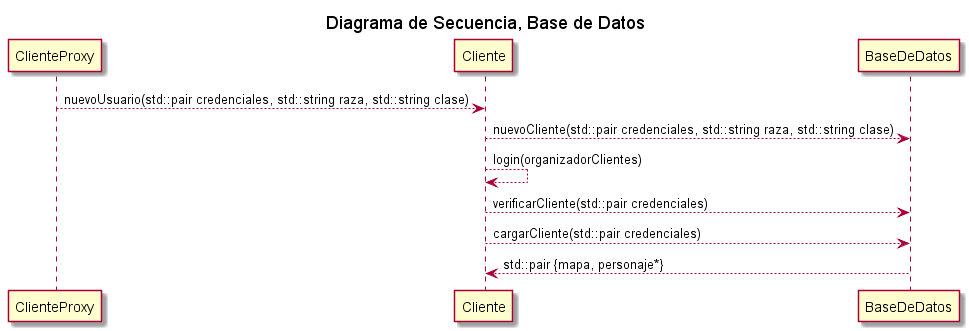

 # Cliente

#### Interfaz de Usuario

##### Descripción general

Aunque dentro del ámbito académico se practican fuertemente las habilidades vinculadas

al desarrollo de modelos óptimos y flexibles, la prioridad principal es siempre lograr

que el usuario final se sienta cómodo con el producto, y esto es especialmente cierto cuando se trabaja en un programa destinado al ocio. Siguiendo esta noción, y con el permiso de los correctores, se optó por distanciarse de los comandos por texto en favor de botones y paneles interactuables.

Cuando se realiza un click con el ratón o se presiona alguna tecla, un evento se dispara y llega a una primer capa (**GUI_Principal** / **GUI_Login**), integrada por todos los botones que desencadenan alguna operación (abrir el inventario, comprar o vender, etc). Los botones y paneles se recorren uno a uno hasta que el evento puede ser respondido por uno de ellos. De no ser así, se alcanza la segunda capa, en donde se averigua si existe en el mapa una entidad en la posición marcada y de ser así, se interactúa con ella.

Todas las partes de la interfaz ajustan su posición según el tamaño de la ventana, pero a excepción de las barras y el estante, no se redimensionan. Existe por ende un tamaño de ventana mínimo, debajo del cual colapsan todos los elementos.

Considerando que la simultaneidad de clientes se evalúa en la misma computadora se decidió no restringir el área de la ventana, para facilitar la depuración del código y su corrección.

##### Clases

El modelo subyacente aprovecha las virtudes del patrón MVC, las clases fundamentales son:

**GUI_Principal :** Reúne la vista de los componentes que integran la interfaz de la pantalla de juego principal.  Sus métodos más importantes son actualizarDimension() y render() que llaman de modo ordenado a los mismos métodos de las clases que ésta instancia.

**GUI_Principal_Controlador :** Su responsabilidad es análoga a **GUI_Principal**, pero con los diversos controladores que agrupa.

**GUI_Clickeable**: Clase base de todo elemento  de la interfaz con el que puede interactuarse, define un área de interacción en su construcción y verifica si la posición absoluta del ratón está contenida en ella al usar su operador (). De ser así llama a enClick, que es un método puramente virtual.

**GUI_BotonControlador**, **GUI_PanelControlador** ,**GUI_SelectorListaControlador** y **GUI_CajaTexto_Controlador** heredan de **GUI_Clickeable** e implementan la mayor parte de la lógica que compete a la interfaz en el método enClick. **GUI_BotonControlador** implementa el método actualizarDimension, que se ajusta automáticamente a la posicion y dimension de la vista.

**GUI_Boton**, **GUI_Panel**, **GUI_SelectorLista** y **GUI_CajaTexto** : Son responsables de mostrar la apariencia que se deduce de sus nombres.

Existen además un gran número de clases que heredan de los controladores y vistas citadas, especificando su comportamiento, su ubicación en la pantalla y su oportuna redimensión ante alguna modificación de la ventana, respectivamente.

**GUI_Chat_Controlador:** Quizás el componente más interesante de la interfaz, pues es el único que simultáneamente envía y recibe mensajes desde el servidor. Los detalles de la implementaciónse discuten en la sección de Comunicación con el Servidor.

**GUI_Chat**: Al igual que su controlador presenta un desafío particular, no poder determinar su aspecto a priori. Renderiza los últimos *n* mensajes en una textura adicional, que se estampa cuadro a cuadro hasta que la llegada de un nuevo mensaje precise actualizar su contenido. A los beneficios en rendimiento de este método se suma la posibilidad de desplazarse verticalmente por la textura (scroll) y así poder mostrar por pantalla una mayor cantidad de mensajes.

##### Diagramas

#### Comunicación con el Servidor

##### Descripción general

La comunicación cliente-servidor suele plantearse como dos interlocutores conversando, pero seguir esta interpretación tan natural, puede llevar a la proliferación de referencias y dependencias cruzadas, muy dificiles de refactorizar en el futuro.

Para el componente del chat no hubo otra alternativa, la entrada y salida de mensajes se canalizan mediante una única instancia de la clase **ServidorProxy**. A los componentes que solo necesitan al servidor para enviar distintas señales (como la de meditación) se les transmite la referencia al ServidorProxy. La solución inmediata es hacer lo inverso con las que solo necesiten recibir información desde el servidor, no obstante esto eventualmente conduce a una clase ServidorProxy que conoce demasiado e incorpora lógica que no le corresponde. La alternativa adoptada se inspira en las planillas que acompañan a los pacientes de los hospitales, y pueden ser leídas/modificadas anacrónicamente por el personal. ServidorProxy conoce dos estructuras de datos: **DatosPersonaje** y **DatosTienda** y se encarga de mantenerlas actualizadas. Al resto de los componentes solo se les transmite la referencia a los campos que necesitan para funcionar. Los atributos son atómicos y cuando se requiere correlacionar dos de ellos (como vida y vida máxima) lo peor que puede ocurrir a raíz de una condición de carrera es que se muestre información incorrecta durante unos instantes.

##### Clases

**Protocolo**: Permite independizarse de las nociones de endianness, sockets y , precisamente, el protocolo. Inicialmente enviaba directamente por socket algún tipo de dato preestablecido, no obstante conforme evolucionó el proyecto surgió la necesidad de incorporar medidas contra el desborde del buffer interno de la operación **send** de los sockets. Por lo que recibe datos directamente del socket, pero para enviar compone primero una tira de bytes, que devuelve en su métodofinalizarEnvio().

**Mensaje**: Encapsula la tira de bytes que compone un mensaje. Permite conocer su tamaño o agregar más bytes al final.

**ColaBloqueanteMensajes:** Especialización de una cola bloqueante que permite conocer la cantidad total de bytes almacenados.

**ProxyEnviador:** Encapsula un hilo que desencola mensajes y los envía. De este modo se aliviana el funcionamiento del ciclo (gameloop) en situaciones extremas, como una conexión lenta.

**ServidorProxy**:  Su responsabilidad fue especificada en la descripción general. Adicionalmente vale la pena notar que la salida del ServidorProxy es redireccionable. En un primer momento se conecta con **ServidorAlerta** para comunicar al usuario cualquier problema en el inicio de sesión, mientras que durante el tiempo de juego se conecta al Chat.

##### Protocolo

El protocolo requiere del envío de enteros de 8,16 y 32 bits y cadenas de texto. Todo entero se transmite en formato Big Endian y a las cadenas de texto las encabezan un entero de 32 bits que marca su longitud. 

A cada operación le precede un identificador único de 32 bits que permite conocer cómo se deben interpretar los bytes recibidos. Si el código de operación no es conocido no puede determinarse cuales de los bytes subsiguientes se corresponderán con la operación fallida y cuáles con la siguiente operación, por lo que no queda más remedio que interrumpir la comunicación entre servidor y cliente.

##### Diagrama

#### Música y sonidos

##### Descripción general

Se emplea la clase singleton **EntornoMusical** para reproducir cualquier tipo de audio. Internamente se utiliza una biblioteca externa para superar las limitaciones de SDL2. Todas las pistas se levantan del disco al momento de la construcción para evitar discontinuidades en el tiempo de respuesta y se organizan en un hash para su fácil acceso.

El mayor desafío de esta área fue determinar cuándo se debía reproducir un sonido determinado, pues en general no se sabe las causas directas de los cambios que el servidor envía. Para los ataques, se reproduce el efecto adecuado la primera vez que aparece un proyectil. La música de fondo no requiere complejas formulaciones, pues cambia solo cuando se inicia sesión exitosamente. Proyectos más abarcativos podrían requerir de la implementación de mensajes cliente-servidor adicionales, que marquen el momento de emitir algún sonido.

# Servidor

#### Mini - Chat

##### Descripción general

Los mensajes de chat que llegan al servidor contienen 3 cadenas: destinatario, remitente y contenido del mensaje. La cadena “ “ (Un solo espacio, configurable) se reserva para señalar los casos en donde el remitente es el propio servidor o el destinatario son todos los clientes. Estos datos se reúnen en una tupla y se encolan en **Divulgador**. 

Ésta clase lanza un hilo al momento de su creación, que se encarga de desencolar una a una las tuplas, interpretar su contenido y en base a los lineamientos expuestos, enviar el contenido a los destinatarios adecuados. Si el nombre del destinatario o el remitente no coincide con el de un usuario activo, se descarta.

Los clientes reciben un mensaje compuesto y se basan en un valor booleano adicional para determinar si mostrar la cadena como una charla privada o pública. Esta última medida es desde ya, puramente estética.

#### Persistencia

##### Descripción general

Adhiriendose a los consejos de la cátedra se dividió la persistencia en dos archivos. El primero, un archivo binario con la constraseña y datos del avatár de cada usuario. El segundo, un json que asocia el nombre de cada usuario con la posición del archivo binario que guarda sus datos. La cantidad de bytes que ocupa cada bloque es constante, y por tanto no es preciso modificar las entradas antiguas del json. **BaseDeDatos** es el responsable de administrar la ubicación de los datos y de anteponerse a las posibles colisiones, intentar crear una nueva cuenta con un id que se haya activo, por ejemplo. No obstante, la serialización y deserialización de cada personaje se delega en la clase del mismo nombre.

Cargar los datos de un usuario al momento de su conexión y respaldarlos cuando se desconecta es suficiente en condiciones ordinarias, pero no protege a los usuarios de la pérdida de información por un fallo de energía por parte del servidor. Se implementó un sistema de persistencia periódica para salvar tal situación…

# !!!!!!!!!!!!!!!!!!!!!!!!!!!!!!!!!!!!!!!!!!!!!

##### Diagrama

#### Formato de archivos

**Archivo de direcciones json:** Sigue el formato   __"nombre_de_usuario" :  desplazamiento__ . El nombre "#", que nunca podrá  ser usado por un usuario se reserva para almacenar la última posición válida dentro del archivo binario.

**Archivo binario:** Cada bloque correspondiente a los datos de un usuario comienza con cuatro cadenas de texto de 20 bytes (Los bytes no usados se rellenan con ceros) que marcan en orden la contraseña, raza, clase e id del último mapa en el que ingresó el jugador. Luego se guarda el struct de serializaciónPersonaje, que al momento de la realización del informe se compone de 9 enteros de 32 bits para distintos atributos del personaje (como la vida, el mana y la experiencia) y 36 enteros de 16 bits para los ids de los elementos guardados en el inventario y el almacén.