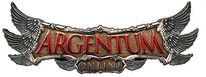

# MANUAL DE USUARIO

Bienvenido a las hermosas y peligrosas tierras de **Argentum Online**. Como dicta un viejo refrán de la zona: "Quien falla en prepararse, debe prepararse para fallar".  Este manual te introducirá a los conceptos básicos para que ninguna criatura pueda enfrentarse a tu sabiduría. Todo comienza en la instalación...


## Instalación

Cliente: Ubicarse en cliente/ y ejecutar "make"
```
cd cliente
make
bin/cliente.out
```

Servidor: Ubicarse en servidor/build y ejecutar "cmake ..". El servidor se ejecuta como "./servidor <configuraciones.json>". Dicho archivo se encuenta en servidor/.
```
cd servidor
mkdir build
cd build
cmake ..
make
./servidor ../configuraciones.json
```


### Requisitos mínimos

#### Software

- Sistema operativo Ubuntu/Linux 32 bits.

- Biblioteca SDL2, SLD_Image, SDL_TTF .
```
sudo apt install -y libsdl2-dev libsdl2-image-dev libsdl2-ttf-dev
```

- Biblioteca Nlohman dev_3.7.0-2: http://mirrors.kernel.org/ubuntu/pool/universe/n/nlohmann-json3/nlohmann-json3-dev_3.7.0-2_all.deb

Alternativamente se puede instalar con ```sudo apt install nlohmann-json3-dev```, pero en algunos sistemas se instala la versión equivocada.


#### Hardware

- Pantalla 400x500 pixeles.
- Memoria Ram de 2 Gb.
- 220 Mb de espacio libre en el disco duro.


### Pantalla de inicio de sesión

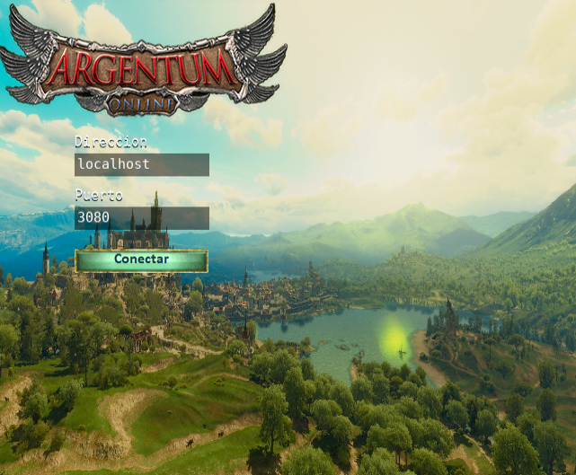

Lo primero que te encontrarás al iniciar la aplicación es este tentador botón de conectar, pero ¡No lo toques aún!, asegúrate que la dirección y el puerto coinciden con las que te ha provisto tu amigo o consulta listas de servidores en línea ¡Hay muchos mundos que explorar!

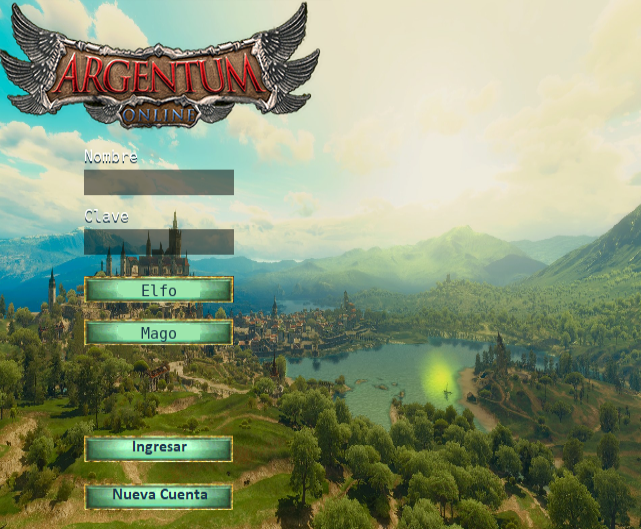

El siguiente paso es elegir un nombre, contraseña, raza y clase. Las últimas dos se seleccionan haciendo click sobre sus correspondientes botones. 

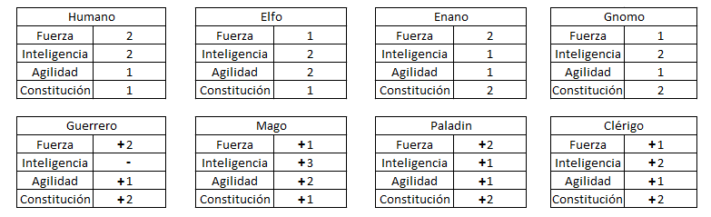

Cada raza presenta distintos atributos iniciales, pero es la clase lo que determina el modo en que evolucionan las estadísticas. El guerrero no puede manipular objetos de naturaleza mágica.

Cuando estés conforme con tu elección pulsa el botón **Nueva Cuenta**.


### Un vistazo general a la interfaz

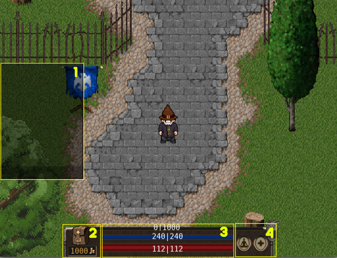

La interfaz puede dividirse en cuatro zonas claramente definidas:

1. El chat donde se comunican todos los jugadores independientemente de su ubicación.
2. El inventario, en donde se muestran los objetos en tu posesión.
3. Tres barras que indican de arriba hacia abajo: experiencia, mana y vida.
4. Botones de meditación , resurrección y una simpática gárgola que muestra tu nivel actual. No te preocupes, no muerde.

### El inventario


Hacer click sobre la bolsa despliega los elementos en tu posesión. Realizar click izquierdo sobre ellos los consume o los equipa, dependiendo del elemento.

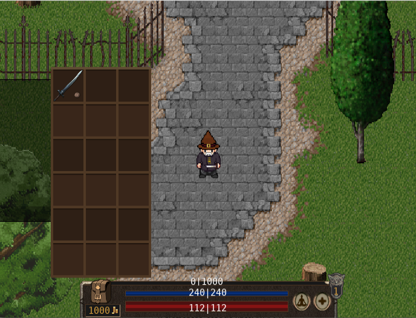

Cuando equipas un arma o pieza de armadura aparece una pequeña mueca sobre su imágen y podrás notar que el personaje ahora viste el elemento marcado.

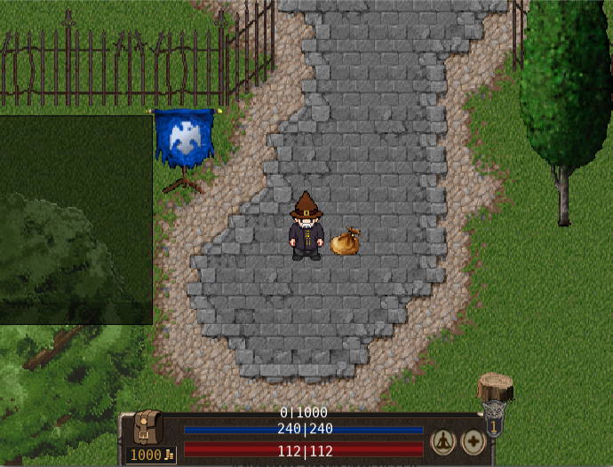

Hacer click derecho o doble click izquierdo sobre un elemento lo arroja al suelo, pero puedes recuperarlo realizando click sobre la bolsa que has dejado atrás.


### Interactuando con los comerciantes

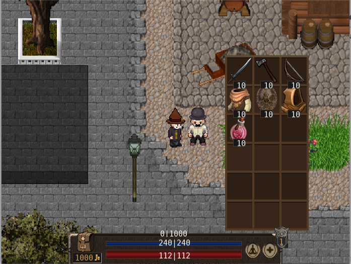

Algunos de los honorables ciudadanos ofrecen sus servicios a quien interactúa con ellos con click izquierdo, En el caso de las tiendas, puedes comprar cualquiera de los elementos que ofrecen si tienes el dinero suficiente. También puedes vender cualquier artículo abriendo tu inventario y efectuando click derecho sobre la posesión que ya no desees poseer.

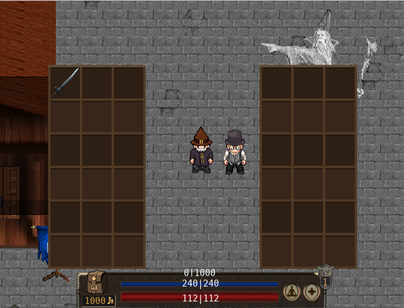

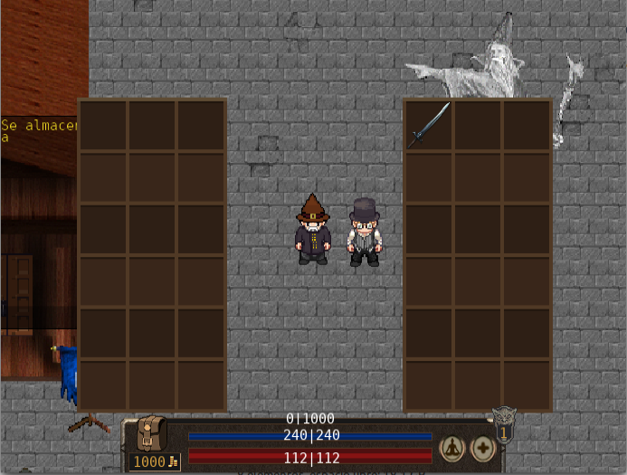

El banquero es un ciudadano particular, pues ofrece gratuitamente la posibilidad de almacenar cualquier pieza que le entregues. ¿Que por qué deberías fiarte de él? ¡Pues porque su familia viene trabajando en el negocio por años! Cuándo logres juntar algo de fé, realiza click derecho sobre cualquier de tus items y éste pasará al panel derecho.

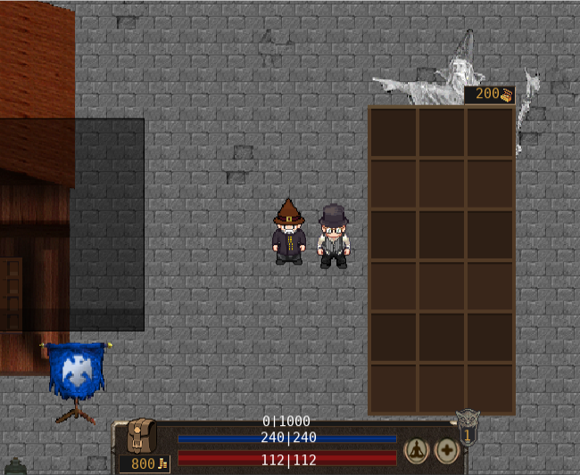

También puedes guardar o retirar una parte de tu oro haciendo click sobre el botón debajo de la bolsa.


### ¡Hola Mundo!

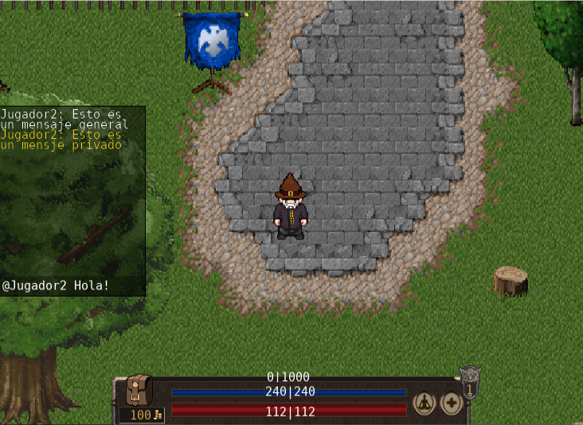

Los ciudadanos son honestos, más no muy charlatanes. Si tocas con el ratón la barra inferior del chat podrás comunicarte con el resto de las personas. Los mensajes en blanco son públicos, mientras que los amarillos solo tu puedes leerlos ¡Cuánto secretismo! 

Para enviar un mensaje privado basta con anteponer  "@nombre-del-destinatario " al mensaje.

### Explorando las tierras


Dentro de las ciudades estás seguro, pero ni bien cruces las puertas te encontrarás con jugadores y  criaturas poco amigables. Los esqueletos no causarán muchos problemas, pero los goblins  desafían hasta a los aventureros más osados. Puedes correr o atacarlos con click derecho...

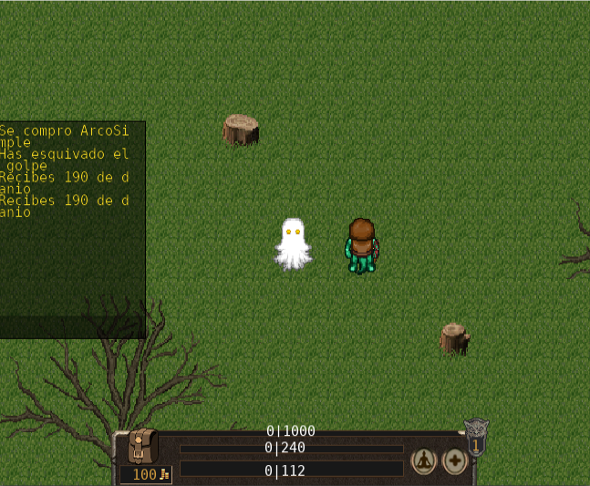

Pero si las cosas no resultan como esperabas lamentamos informarte que perderás todo lo que lleves encima y gran parte de tus ganancias. El banquero no suena tan mal después de todo, ¿Verdad?

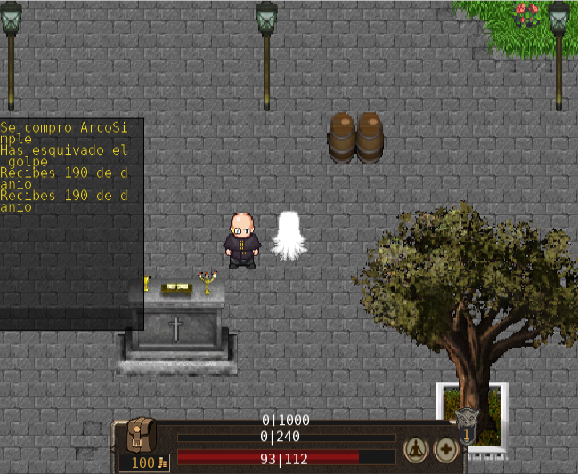

En todo caso la muerte no es el fin, busca al sacerdote y realiza click derecho sobre él para volver a la vida o presiona el botón con la cruz para ahorrarte el viaje. Con eso dicho, los sacerdotes no priorizan a los fantasmas vagos, tendrás que esperar a que te atienda si eliges esta segunda opción. La barra de vida se llenará progresivamente, indicando el tiempo restante para resucitar.

El botón de meditación, a la izquierda del de resurrección puede usarse en cualquier momento para restaurar maná.


### Argentum con amigos

Crear tu propio servidor es tan sencillo como ejecutar "servidor" y pasarle un archivo de configuración por la línea de comandos. Dentro del archivo de configuración y los mapas que vienen incluidos con la instalación podrás leer y editar cada aspecto a tu gusto. La dirección y el puerto del servidor son lo primero que debes cambiar, el resto solo se ve limitado por tu imaginación. ¿Quieres mover un árbol 3 m a la derecha? Lo tienes. ¿Bajar el precio de venta de los artículos de un pobre comerciante?  Desde ya. ¿Hacer aparecer a tu amigos en un pozo lleno de zombies? No garantizamos que persista su amistad, pero tampoco hemos implementado restricciones. 


### ¡La aventura te espera!

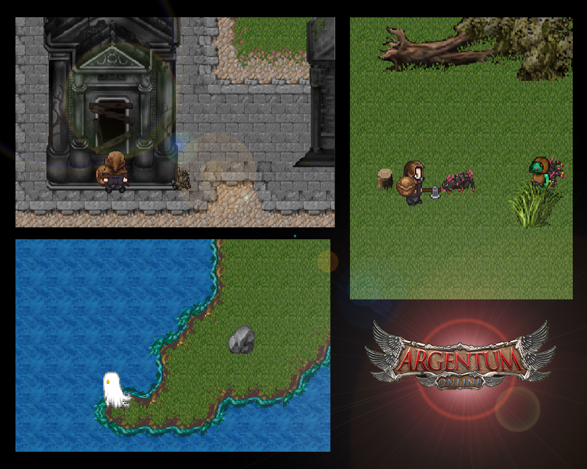

El mundo esta lleno de paisajes que disfrutar, amigos que conocer y enemigos que derrotar. ¡Alcanza la mejor versión de ti mismo! En **Argentum Online**.


